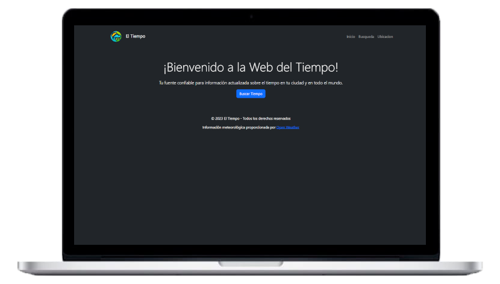
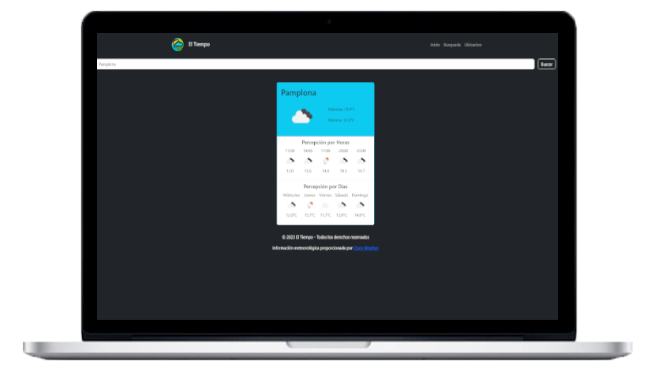
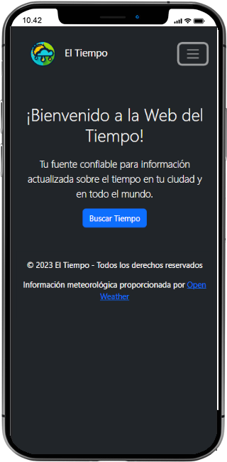
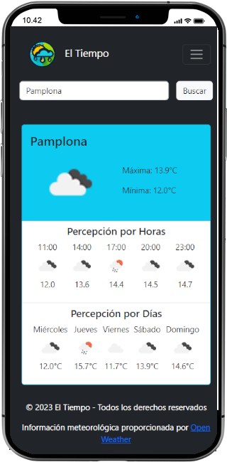

# Weather-is-sweet-yeah

¡Bienvenido a la Web del Tiempo! Este es un sitio web que proporciona información actualizada sobre el tiempo en tu ciudad y en todo el mundo. La aplicación utiliza la API de OpenWeather para obtener datos meteorológicos precisos y confiables.

## API de OpenWeather
El Tiempo utiliza la API de OpenWeather para obtener datos meteorológicos. OpenWeather es una fuente de datos confiable y ofrece una amplia gama de información meteorológica, incluyendo pronósticos actuales, pronósticos por hora y por días, así como información sobre la ubicación. Puedes obtener más información sobre la API de OpenWeather en su [sitio web oficial](https://openweathermap.org/).

## Tecnologías Utilizadas
Este sitio web ha sido desarrollado utilizando las siguientes tecnologías:

- HTML5
- CSS
- JavaScript
- Bootstrap
- jQuery

## Capturas de Pantalla

### En PC

### En PC Funcionando

### En Dispositivos Móviles

### En Dispositivos Móviles Funcionando

## Cómo Funciona
1. **Inicio**: En la página de inicio, recibirás una bienvenida y una breve descripción del sitio. Puedes hacer clic en "Buscar Tiempo" para realizar una búsqueda.

2. **Búsqueda**: En la página de búsqueda, puedes ingresar el nombre de una ciudad y hacer clic en "Buscar" para obtener información meteorológica actualizada para esa ubicación.

3. **Ubicación**: La página de ubicación te permite acceder a información meteorológica basada en tu ubicación actual.

## Contribuciones
Si deseas contribuir o mejorar este proyecto, ¡siéntete libre de hacer un fork y enviar tus pull requests!

